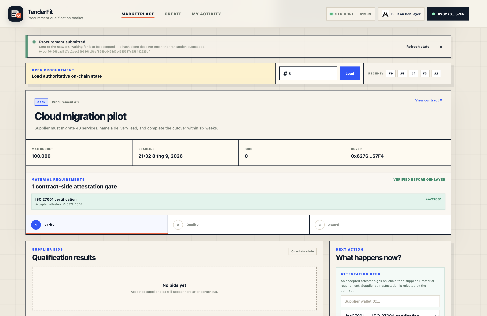
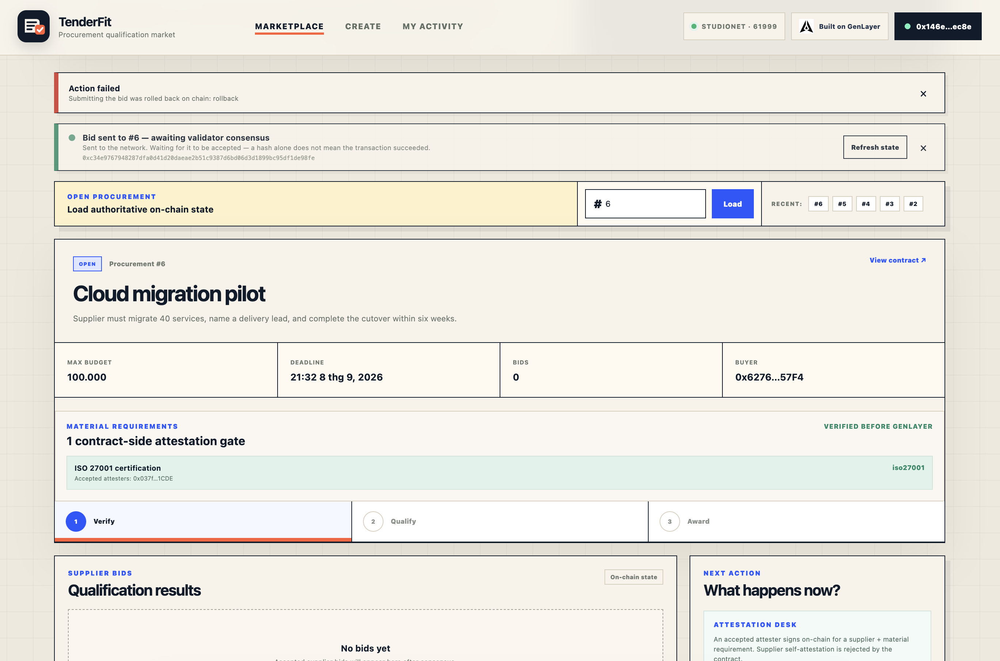
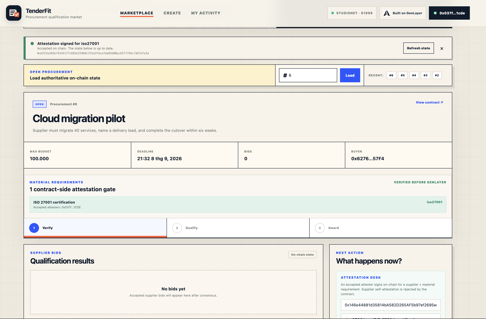
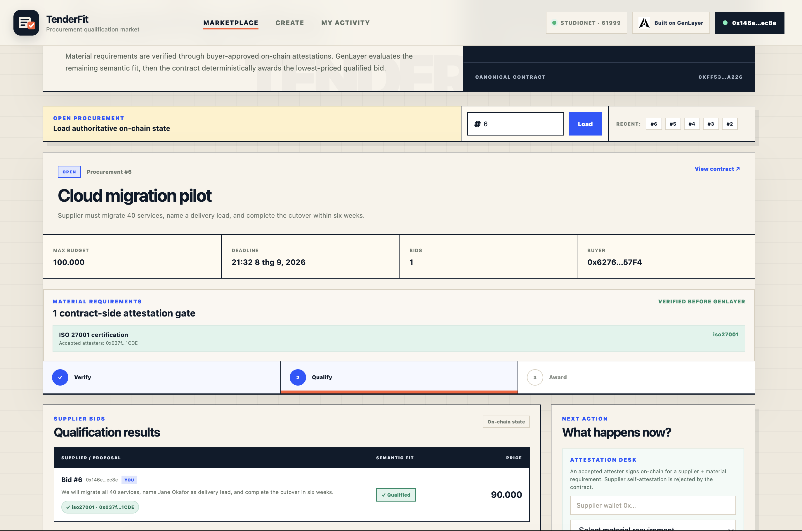
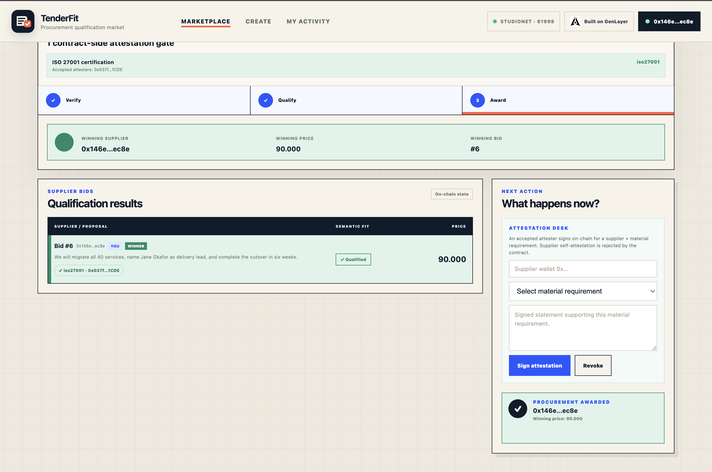

# TESTING — TenderFit

Canonical StudioNet contract:

```text
0xfF53f36e409FBC2d42b15e214801656006A7A226
```

Explorer:
https://explorer-studio.genlayer.com/address/0xfF53f36e409FBC2d42b15e214801656006A7A226

Live dApp: https://tender-fit.vercel.app/

---

## Two kinds of evidence in this repository

**Reproducible.** The contract's deterministic behaviour is covered by
[`tests/`](tests/README.md) — 48 tests that run `contracts/TenderFit.py` on a
real GenVM build, plus a mutation matrix that confirms they fail when the
property they defend is broken. Anyone can re-run those in about two minutes:

```bash
pip install "genlayer-test==0.29.2" "pytest>=8,<9"
python3 -m pytest tests/ -q
python3 tests/mutation_check.py
```

**Observed.** Everything below happened once, on StudioNet, through the live
frontend. It is recorded here because the AI-adjudication half cannot be
re-run deterministically — a second attempt is a second independent judgment.
Screenshots are in [`docs/evidence/`](docs/evidence).

---

## End-to-end run — procurement #6

Three wallets, because the contract requires them to be distinct:

```text
Buyer     0x6276…57F4
Attester  0x037f…1CDE
Supplier  0x146e…ec8e
```

### 1. Create the procurement

`create_procurement` — buyer wallet.

```text
0xbc4f64966cadf17ac2cec699636fc5bef8949b0498d7b4585037c558482625bf
```

Title *Cloud migration pilot*, budget 100000, one material requirement
(`iso27001`, accepted attester `0x037f…1CDE`).



The notice is the point of the screenshot: while the transaction is in flight it
says **"a hash alone does not mean the transaction succeeded"**. Before this
release the app declared success at exactly this moment.

### 2. Bid before the attestation exists — rejected

`submit_bid` — supplier wallet, no attestation signed yet.

```text
0xc34e9767948287dfa0d41d20daeae2b51c9387d6bd06d3d1899bc95df1de98fe
```



**Rolled back on chain, and reported as a failure.** This is the deterministic
attestation gate doing its job — the material requirement had no signature, so
the bid never reached the model. It is also the clearest demonstration of the
receipt-waiting fix: the transaction produced a hash, and the app still refused
to call it a success.

### 3. Sign the attestation

`attest` — attester wallet, for the supplier and `iso27001`.

```text
0xb523a285b74244177c693e22968c37ba3fdcefda83d00ac65f779dc7d6fe7e3a
```



### 4. Bid again — one rejection, then qualified

The same bid text, resubmitted after the attestation existed, was **rolled back
once more**:

```text
0x3c00ad4dc4a394310e66dc9c3d28f682213f37fad0b21fe4817b6c16bec710c0
```

A third attempt, byte-identical, was accepted and qualified.



This is worth stating plainly rather than hiding, because a reviewer may hit it
too. `submit_bid` runs `gl.vm.run_nondet_unsafe`, and the validator re-runs the
judgment independently. When the leader's verdict and the validator's do not
match, there is no consensus and the **whole transaction reverts** — the bid is
not recorded either way. That is the design failing closed, not a defect: an
ambiguous semantic verdict is never allowed to settle. The practical
consequence is that a borderline proposal may need resubmitting, and each
attempt is a fresh, independent judgment. Tracked in
[SECURITY.md](SECURITY.md) §4.

The bid card shows both layers: the green `iso27001 · 0x037f…1CDE` chip is the
contract-side attestation, and **Qualified** is the GenLayer verdict on the
remaining natural-language commitments.

### 5. Finalize

After the bidding deadline, `finalize_procurement`. Award selection runs no
model at all — lowest qualified price, ties to the lower bid id.



```text
Status          RESOLVED
Winning bid     #6
Winning supplier 0x146e…ec8e
Winning price   90000
```

**This end state is verifiable now.** Open https://tender-fit.vercel.app/, enter
`6`, press Load — or call `get_procurement(6)` on the contract directly. It is
on-chain state, not a claim in a document.

---

## What the transaction hashes above do and do not show

The four hashes are the transactions where one was captured at the time. The
successful bid and the finalize transaction were recorded by screenshot and by
their resulting on-chain state rather than by hash; the state they produced is
the stronger evidence anyway, because it can still be read today.

No hash in this file is reconstructed or inferred. Where one was not recorded,
this document says so instead of supplying a plausible-looking value.

---

## Reviewer flow

To repeat this end to end you need three wallets on StudioNet (chain 61999).
The contract enforces the separation: a supplier cannot attest for itself, a
buyer cannot be its own accepted attester, and a buyer cannot bid on its own
procurement.

1. **Buyer** — CREATE tab: title, brief, budget, a deadline far enough ahead to
   finish (30+ minutes), and one material requirement naming the attester's
   address.
2. **Attester** — Attestation desk: the supplier's address, the requirement, a
   signed statement.
3. **Supplier** — Submit a bid: price within budget, and a proposal that
   commits to every mandatory requirement in the brief.
4. **Anyone**, after the deadline — Finalize.

The right-hand panel changes with the connected wallet: the bid form only
appears for a non-buyer, and the finalize button only for the buyer once the
deadline has passed.
